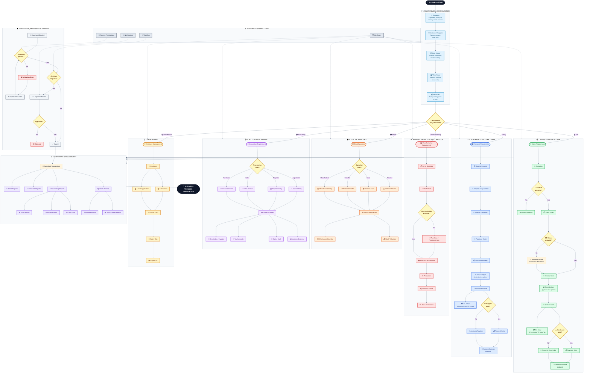

```mermaid
%%{init: {
  "theme": "base",
  "themeVariables": {
    "fontSize": "16px",
    "fontFamily": "Segoe UI, Arial, sans-serif",
    "lineColor": "#64748B",
    "primaryTextColor": "#0F172A",
    "clusterBkg": "#F8FAFC",
    "clusterBorder": "#94A3B8"
  },
  "flowchart": {
    "curve": "basis",
    "nodeSpacing": 45,
    "rankSpacing": 60,
    "padding": 12,
    "htmlLabels": true
  }
}}%%
flowchart TD

    START(["🚀 BUSINESS START"])

    %% ================= MASTER DATA =================
    subgraph MASTER["🧩 1. MASTER DATA & CONFIGURATION"]
        direction TB
        COMPANY["🏢 Company<br/><small>Legal entity, fiscal year,<br/>currency, default accounts</small>"]
        PARTY["👤 Customer / Supplier<br/><small>Partners, contacts,<br/>credit limits</small>"]
        ITEM["📦 Item Master<br/><small>Products, UOM, taxes,<br/>valuation settings</small>"]
        WAREHOUSE["🏭 Warehouse<br/><small>Inventory locations<br/>& ownership</small>"]
        PRICE["💰 Price List<br/><small>Buying / selling prices<br/>& rules</small>"]

        COMPANY --> PARTY --> ITEM --> WAREHOUSE --> PRICE
    end

    START --> COMPANY
    PRICE --> REQUEST

    %% ================= BUSINESS ROUTER =================
    REQUEST{"🔀 BUSINESS<br/>REQUIREMENT"}

    REQUEST -->|🟢 Sell| SALES_START
    REQUEST -->|🔵 Buy| PURCHASE_START
    REQUEST -->|🟠 Stock| STOCK_START
    REQUEST -->|🟣 Accounting| ACCOUNT_START
    REQUEST -->|🔴 Manufacturing| MANUFACTURING_START
    REQUEST -->|🟡 HR / Payroll| HR_START

    %% ================= SALES =================
    subgraph SALES["🟢 2. SALES — ORDER TO CASH"]
        direction TB
        SALES_START(["🛒 Sales Requirement"])
        QUOTATION["📄 Quotation"]
        QUOTE_DECISION{"Customer<br/>accepts?"}
        QUOTE_CLOSE["❌ Closed / Expired"]
        SALES_ORDER["📋 Sales Order"]
        STOCK_CHECK{"📦 Stock<br/>available?"}
        REPLENISH["🔄 Replenish Stock<br/><small>Purchase or Manufacture</small>"]
        DELIVERY["🚚 Delivery Note"]
        SALE_STOCK["📊 Stock Ledger<br/><small>Qty & valuation updated</small>"]
        SALES_INVOICE["🧾 Sales Invoice"]
        SALE_GL["💳 GL Entry<br/><small>Dr Receivable / Cr Sales+Tax</small>"]
        PAYMENT_CHECK{"💵 Customer<br/>paid?"}
        AR["📌 Accounts Receivable"]
        SALE_PAYMENT["💰 Payment Entry"]
        CUSTOMER_BALANCE["👤 Customer Balance<br/>Updated"]

        SALES_START --> QUOTATION --> QUOTE_DECISION
        QUOTE_DECISION -->|No| QUOTE_CLOSE
        QUOTE_DECISION -->|Yes| SALES_ORDER
        SALES_ORDER --> STOCK_CHECK
        STOCK_CHECK -->|Yes| DELIVERY
        STOCK_CHECK -->|No| REPLENISH --> DELIVERY
        DELIVERY --> SALE_STOCK --> SALES_INVOICE
        SALES_INVOICE --> SALE_GL
        SALES_INVOICE --> PAYMENT_CHECK
        PAYMENT_CHECK -->|Yes| SALE_PAYMENT
        PAYMENT_CHECK -->|No| AR
        SALE_PAYMENT --> CUSTOMER_BALANCE
        AR --> CUSTOMER_BALANCE
    end

    %% ================= PURCHASE =================
    subgraph PURCHASE["🔵 3. PURCHASE — PROCURE TO PAY"]
        direction TB
        PURCHASE_START(["🛍️ Purchase Requirement"])
        MATERIAL_REQUEST["📋 Material Request"]
        RFQ["📨 Request for Quotation"]
        SUPPLIER_QUOTATION["💬 Supplier Quotation"]
        PURCHASE_ORDER["📑 Purchase Order"]
        PURCHASE_RECEIPT["📦 Purchase Receipt"]
        PURCHASE_STOCK["📊 Stock Ledger<br/><small>Qty & valuation updated</small>"]
        PURCHASE_INVOICE["🧾 Purchase Invoice"]
        PURCHASE_GL["💳 GL Entry<br/><small>Dr Expense/Asset / Cr Payable</small>"]
        SUPPLIER_PAYMENT_CHECK{"💵 Supplier<br/>paid?"}
        AP["📌 Accounts Payable"]
        SUPPLIER_PAYMENT["💰 Payment Entry"]
        SUPPLIER_BALANCE["👤 Supplier Balance<br/>Updated"]

        PURCHASE_START --> MATERIAL_REQUEST --> RFQ --> SUPPLIER_QUOTATION
        SUPPLIER_QUOTATION --> PURCHASE_ORDER --> PURCHASE_RECEIPT
        PURCHASE_RECEIPT --> PURCHASE_STOCK --> PURCHASE_INVOICE
        PURCHASE_INVOICE --> PURCHASE_GL
        PURCHASE_INVOICE --> SUPPLIER_PAYMENT_CHECK
        SUPPLIER_PAYMENT_CHECK -->|Yes| SUPPLIER_PAYMENT
        SUPPLIER_PAYMENT_CHECK -->|No| AP
        SUPPLIER_PAYMENT --> SUPPLIER_BALANCE
        AP --> SUPPLIER_BALANCE
    end

    %% ================= STOCK =================
    subgraph STOCK["🟠 4. STOCK & INVENTORY"]
        direction TB
        STOCK_START(["📦 Stock Operation"])
        STOCK_TYPE{"Operation<br/>Type?"}
        RECEIPT["📥 Material Receipt"]
        ISSUE["📤 Material Issue"]
        TRANSFER["🔁 Material Transfer"]
        STOCK_MANUFACTURE["🏭 Manufacture Entry"]
        STOCK_LEDGER["📊 Stock Ledger Entry"]
        STOCK_QTY["📦 Warehouse Quantity"]
        STOCK_VALUE["💰 Stock Valuation"]

        STOCK_START --> STOCK_TYPE
        STOCK_TYPE -->|Receive| RECEIPT
        STOCK_TYPE -->|Issue| ISSUE
        STOCK_TYPE -->|Transfer| TRANSFER
        STOCK_TYPE -->|Manufacture| STOCK_MANUFACTURE
        RECEIPT --> STOCK_LEDGER
        ISSUE --> STOCK_LEDGER
        TRANSFER --> STOCK_LEDGER
        STOCK_MANUFACTURE --> STOCK_LEDGER
        STOCK_LEDGER --> STOCK_QTY
        STOCK_LEDGER --> STOCK_VALUE
    end

    %% ================= ACCOUNTING =================
    subgraph ACCOUNTING["🟣 5. ACCOUNTING & FINANCE"]
        direction TB
        ACCOUNT_START(["💼 Accounting Requirement"])
        ACCOUNT_TYPE{"Transaction<br/>Type?"}
        JOURNAL["📔 Journal Entry"]
        PAYMENT["💰 Payment Entry"]
        ACCOUNT_SALES["🧾 Sales Invoice"]
        ACCOUNT_PURCHASE["🧾 Purchase Invoice"]
        GL["📚 General Ledger"]
        RECEIVABLE_PAYABLE["👥 Receivable / Payable"]
        TAX_ACCOUNTS["🧮 Tax Accounts"]
        CASH_BANK["🏦 Cash / Bank"]
        INCOME_EXPENSE["📈 Income / Expense"]

        ACCOUNT_START --> ACCOUNT_TYPE
        ACCOUNT_TYPE -->|Adjustment| JOURNAL
        ACCOUNT_TYPE -->|Payment| PAYMENT
        ACCOUNT_TYPE -->|Sales| ACCOUNT_SALES
        ACCOUNT_TYPE -->|Purchase| ACCOUNT_PURCHASE
        JOURNAL --> GL
        PAYMENT --> GL
        ACCOUNT_SALES --> GL
        ACCOUNT_PURCHASE --> GL
        GL --> RECEIVABLE_PAYABLE
        GL --> TAX_ACCOUNTS
        GL --> CASH_BANK
        GL --> INCOME_EXPENSE
    end

    %% ================= MANUFACTURING =================
    subgraph MANUFACTURING["🔴 6. MANUFACTURING — PLAN TO PRODUCE"]
        direction TB
        MANUFACTURING_START(["🏭 Manufacturing Requirement"])
        BOM["📋 Bill of Materials"]
        WORK_ORDER["📝 Work Order"]
        RAW_CHECK{"Raw materials<br/>available?"}
        RAW_PURCHASE["🛒 Purchase / Replenishment"]
        CONSUMPTION["📤 Material Consumption"]
        PRODUCTION["⚙️ Production"]
        FINISHED["📦 Finished Goods"]
        MANUFACTURING_STOCK["📊 Stock + Valuation"]

        MANUFACTURING_START --> BOM --> WORK_ORDER --> RAW_CHECK
        RAW_CHECK -->|No| RAW_PURCHASE --> CONSUMPTION
        RAW_CHECK -->|Yes| CONSUMPTION
        CONSUMPTION --> PRODUCTION --> FINISHED --> MANUFACTURING_STOCK
    end

    %% ================= HR =================
    subgraph HR["🟡 7. HR & PAYROLL"]
        direction TB
        HR_START(["👥 Employee Management"])
        EMPLOYEE["👤 Employee"]
        ATTENDANCE["🕘 Attendance"]
        LEAVE["🏖️ Leave Application"]
        PAYROLL["💵 Payroll Entry"]
        SALARY_SLIP["📄 Salary Slip"]
        PAYROLL_GL["📚 Payroll GL"]

        HR_START --> EMPLOYEE
        EMPLOYEE --> ATTENDANCE
        EMPLOYEE --> LEAVE
        ATTENDANCE --> PAYROLL
        LEAVE --> PAYROLL
        PAYROLL --> SALARY_SLIP --> PAYROLL_GL
    end

    %% ================= CONTROL =================
    subgraph CONTROL["🛡️ 8. VALIDATION, PERMISSION & APPROVAL"]
        direction TB
        DRAFT["📝 Document Created"]
        VALIDATE{"Validation<br/>passed?"}
        ERROR["⚠️ Validation Error"]
        CORRECT["✏️ Correct Document"]
        APPROVAL_CHECK{"Approval<br/>required?"}
        APPROVER["👨‍💼 Approver Review"]
        APPROVAL_DECISION{"Approved?"}
        REJECT["❌ Rejected"]
        SUBMIT["✅ Submit"]

        DRAFT --> VALIDATE
        VALIDATE -->|No| ERROR --> CORRECT --> VALIDATE
        VALIDATE -->|Yes| APPROVAL_CHECK
        APPROVAL_CHECK -->|No| SUBMIT
        APPROVAL_CHECK -->|Yes| APPROVER --> APPROVAL_DECISION
        APPROVAL_DECISION -->|No| REJECT
        APPROVAL_DECISION -->|Yes| SUBMIT
    end

    %% ================= REPORTING =================
    subgraph REPORTING["📊 9. REPORTING & MANAGEMENT"]
        direction TB
        REPORT_START["📑 Submitted Transactions"]
        SALES_REPORT["📈 Sales Reports"]
        PURCHASE_REPORT["📉 Purchase Reports"]
        STOCK_REPORT["📦 Stock Reports"]
        ACCOUNT_REPORT["💼 Accounting Reports"]
        PL["📊 Profit & Loss"]
        BALANCE["⚖️ Balance Sheet"]
        CASHFLOW["💵 Cash Flow"]
        STOCK_BALANCE["📦 Stock Balance"]
        STOCK_LEDGER_REPORT["📚 Stock Ledger Report"]

        REPORT_START --> SALES_REPORT
        REPORT_START --> PURCHASE_REPORT
        REPORT_START --> STOCK_REPORT
        REPORT_START --> ACCOUNT_REPORT
        ACCOUNT_REPORT --> PL
        ACCOUNT_REPORT --> BALANCE
        ACCOUNT_REPORT --> CASHFLOW
        STOCK_REPORT --> STOCK_BALANCE
        STOCK_REPORT --> STOCK_LEDGER_REPORT
    end

    %% ================= SYSTEM =================
    subgraph SYSTEM["⚙️ 10. ERPNEXT SYSTEM LAYER"]
        direction LR
        DOCTYPES["🗂️ DocTypes"]
        PERMISSIONS["🔐 Roles & Permissions"]
        WORKFLOW["🔄 Workflow"]
        NOTIFICATIONS["🔔 Notifications"]
    end

    %% ================= LINKS =================
    SALES --> REPORTING
    PURCHASE --> REPORTING
    STOCK --> REPORTING
    ACCOUNTING --> REPORTING
    MANUFACTURING --> REPORTING
    HR --> REPORTING

    SUBMIT --> REPORT_START

    DOCTYPES -.-> SALES
    DOCTYPES -.-> PURCHASE
    DOCTYPES -.-> STOCK
    DOCTYPES -.-> ACCOUNTING
    DOCTYPES -.-> MANUFACTURING
    DOCTYPES -.-> HR

    PERMISSIONS -.-> VALIDATE
    WORKFLOW -.-> APPROVAL_CHECK
    NOTIFICATIONS -.-> APPROVER

    REPORTING --> DONE(["🎯 BUSINESS PROCESS COMPLETED"])

    %% ================= STYLES =================
    classDef startEnd fill:#0F172A,stroke:#0F172A,color:#FFFFFF,stroke-width:3px,font-size:18px,font-weight:bold;

    classDef master fill:#E0F2FE,stroke:#0284C7,color:#0C4A6E,stroke-width:2px;
    classDef sales fill:#DCFCE7,stroke:#16A34A,color:#14532D,stroke-width:2px;
    classDef purchase fill:#DBEAFE,stroke:#2563EB,color:#1E3A8A,stroke-width:2px;
    classDef stock fill:#FFEDD5,stroke:#EA580C,color:#7C2D12,stroke-width:2px;
    classDef accounting fill:#F3E8FF,stroke:#9333EA,color:#581C87,stroke-width:2px;
    classDef manufacturing fill:#FEE2E2,stroke:#DC2626,color:#7F1D1D,stroke-width:2px;
    classDef hr fill:#FEF3C7,stroke:#D97706,color:#78350F,stroke-width:2px;
    classDef control fill:#F1F5F9,stroke:#475569,color:#0F172A,stroke-width:2px;
    classDef decision fill:#FEF9C3,stroke:#CA8A04,color:#713F12,stroke-width:3px,font-weight:bold;
    classDef report fill:#EDE9FE,stroke:#7C3AED,color:#4C1D95,stroke-width:2px;
    classDef system fill:#E2E8F0,stroke:#475569,color:#1E293B,stroke-width:2px;
    classDef error fill:#FEE2E2,stroke:#DC2626,color:#7F1D1D,stroke-width:2px,font-weight:bold;

    class START,DONE startEnd;
    class COMPANY,PARTY,ITEM,WAREHOUSE,PRICE master;
    class SALES_START,QUOTATION,QUOTE_CLOSE,SALES_ORDER,DELIVERY,SALE_STOCK,SALES_INVOICE,SALE_GL,SALE_PAYMENT,AR,CUSTOMER_BALANCE sales;
    class PURCHASE_START,MATERIAL_REQUEST,RFQ,SUPPLIER_QUOTATION,PURCHASE_ORDER,PURCHASE_RECEIPT,PURCHASE_STOCK,PURCHASE_INVOICE,PURCHASE_GL,SUPPLIER_PAYMENT,AP,SUPPLIER_BALANCE purchase;
    class STOCK_START,RECEIPT,ISSUE,TRANSFER,STOCK_MANUFACTURE,STOCK_LEDGER,STOCK_QTY,STOCK_VALUE stock;
    class ACCOUNT_START,JOURNAL,PAYMENT,ACCOUNT_SALES,ACCOUNT_PURCHASE,GL,RECEIVABLE_PAYABLE,TAX_ACCOUNTS,CASH_BANK,INCOME_EXPENSE accounting;
    class MANUFACTURING_START,BOM,WORK_ORDER,RAW_PURCHASE,CONSUMPTION,PRODUCTION,FINISHED,MANUFACTURING_STOCK manufacturing;
    class HR_START,EMPLOYEE,ATTENDANCE,LEAVE,PAYROLL,SALARY_SLIP,PAYROLL_GL hr;
    class DRAFT,CORRECT,SUBMIT,APPROVER control;
    class ERROR,REJECT error;
    class SALES_REPORT,PURCHASE_REPORT,STOCK_REPORT,ACCOUNT_REPORT,PL,BALANCE,CASHFLOW,STOCK_BALANCE,STOCK_LEDGER_REPORT report;
    class DOCTYPES,PERMISSIONS,WORKFLOW,NOTIFICATIONS system;
    class REQUEST,QUOTE_DECISION,STOCK_CHECK,PAYMENT_CHECK,SUPPLIER_PAYMENT_CHECK,STOCK_TYPE,ACCOUNT_TYPE,RAW_CHECK,VALIDATE,APPROVAL_CHECK,APPROVAL_DECISION decision;
```
